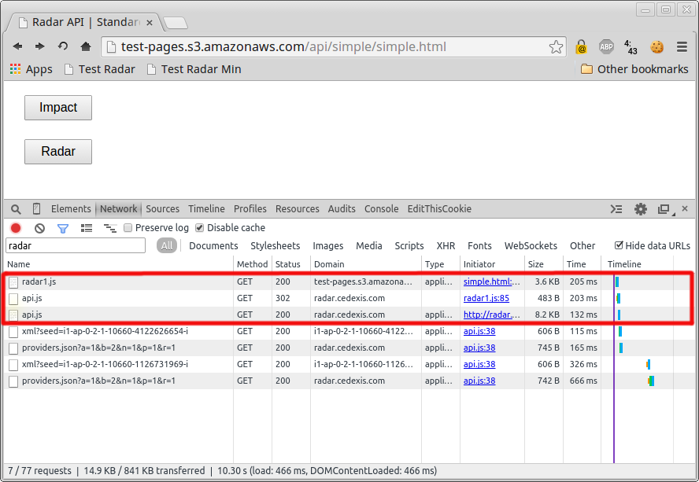

# Radar JavaScript API

As an alternative to the mainstream Cedexis Radar client, this library gives site
admins and developers greater control over the timing and nature of Radar sessions
and Impact events.  It is geared mainly for use in web applications featuring a
single page interface, where multiple user actions can take place within the
context of a single page view over the course of several minutes.

The basic process is:

1. Add the bootstrap JavaScript snippet to your site.
2. Write code to trigger Radar sessions and Impact events.

We'll describe this process in detail below.

## Reference Test Page

In this document we refer to illustrations and code listings taken from a simple
test page, which you encouraged to examine, available at
http://test-pages.s3.amazonaws.com/api/simple/simple.html.

The page just contains two buttons.  When clicked, one executes a Radar session
and the other reports an Impact event.

The code listing behind this page, which shows how the button click handlers
use the Radar API is available at http://test-pages.s3.amazonaws.com/api/simple/ui.js.

## Bootstrap Snippet

This repository contains both [minified](./js/radar1.min.js) and
[unminified](./js/radar1.js) versions of the bootstrap snippet.

The best way to integrate this snippet into your site is to host one of these
files along with your other static assets and then reference it as an external
script from within your page anywhere before other scripts that use the library.
For example, suppose that:

1. You host your JavaScript files on assets.foo.com in a directory called `js`.
2. Your own site code lives in a file called site.js, and from this file
   you need access to the API provided by the bootstap snippet.

Then in your HTML, you add a link to the Radar bootstap file above the link to
site.js like this:

```html
<!DOCTYPE html>
<html>
<head>
    <title>Your Site Title</title>
</head>
<body>
    <!-- Your other markup -->

    <script src="//assets.foo.com/js/radar1.min.js"></script>
    <script src="//assets.foo.com/js/site.js"></script>
</body>
</html>
```

The bootstrap snippet should very rarely change, so for best performance you can
safely specify headers allowing it to be cached indefinitely by browser and
intermediate caches (two weeks is a suggested minimum timeframe).  We include a
version number in the filename to help manage any changes that may come about in
the future.

Alternatively, you could simply include the content of the bootstrap JavaScript
file as an inline script in your HTML.  The main drawback of this approach is
that it increases the size of your page by about 1&nbsp;KB (the approximate size of
the minified bootstrap file).

**What to expect when the page loads**

The role of the bootstrap code is to create some stub functions and then
initiate the download of the actual Radar JavaScript API code from
radar.cedexis.com, which it does from an onload event handler.  You can
see these downloads outlined in red in the image below.



The initial request to http://radar.cedexis.com/radar/api.js redirects to a
fingerprinted URL such as
http://radar.cedexis.com/radar/1429903024/QoGi4hp3JDoU5pP4vzR9wne0neW6NqA0/api.js.
The redirect response is set to be cacheable for about an hour, while the final
resource is set to be cacheable for two weeks, so visitors will usually not have
to download it again on subsequent visits.

Once the api.js file is downloaded and executed, the stubs created by the
bootstrap snippet will have been replaced (monkey patched) by real versions from
the API.  This allows your site code to make calls to the API before it is
actually available without breaking.  These calls are simply placed in a queue
and should begin to execute as soon as the API becomes available.  From your
point of view, this transition should be completely seamless.  You need only be
concerned with how your site functions and at what points you would like to make
a Radar API call, not whether the API is actually ready to accept calls.

The use of bootstrap code to generate stubs, downloading the actual API code
from the window onload event, and making that code highly cacheable is meant to
ensure that the Radar API rests as lightly on your site and is as
easy to use as possible.

## API Reference

### cedexis.api.create()

#### Summary

The cedexis.api.create function creates and returns a RadarApi object.

#### Syntax

**cedexis.api.create(settings)**

#### Parameters

**settings**

A JavaScript object having the following properties:

| Name | Type | Required | Description |
| ---- | ---- | -------- | ----------- |
| zoneId | number | no | Your Cedexis Zone ID (defaults to 1) |
| customerId | number | **yes** | Your Cedexis Customer ID |
| cookieDomain | string | no | The domain to be set on any cookies backing Impact event reporting.  Normally you should set this to your website domain prefaced with a period (.).<br><br>Example: .www.foo.com |
| cookiePath | string | no | The pathname to be set on any cookies backing Impact event reporting.  If not set, defaults to "/". |
| site | string | no | An optional metadatum to be attached to Impact event reports.  This would allow Impact events to be differentiated between different sites for the same customer, which may be necessary for certain use cases. |
| clearResourceTimings | boolean | no | If given and set to `true`, every event generated will cause Resource Timing data to be purged. |
| resourceTimingBufferSize | number | no | If given, every event generated will cause the Resource Timing object buffer to be set to the specified number. | |

#### Description

The RadarApi object returned by cedexis.api.create() bears methods used to
invoke Radar sessions and report Impact events.  This should be stored and
reused throughout the life of the web application.

#### Examples

Create a simple RadarApi object for use with Radar and Impact on www.foo.com
where each event causes the Resource Timing data cache to be purged:

```javascript
var api = cedexis.api.create({
    customerId: 12345,
    cookieDomain: '.www.foo.com',
    clearResourceTimings: true
});
```

Suppose you run a site that services multiple tenants and you want to
differentiate between them based on runtime settings through the `site`
property:

```javascript
var api = cedexis.api.create({
    customerId: 12345,
    cookieDomain: '.www.foo.com',
    site: getTenantId()
});

/**
 * A hypothetical function
 * @return {string} the tenant ID
 */
function getTenantId() {
    // Code to access the tenant ID from your web framework here...
}
```

### RadarApi.prototype.radar()

#### Summary

Execute a Radar session.

#### Syntax

**api.radar([settings])**

The optional `settings` object allows you to specify the following session
properties:

| Name | Type | Required | Description |
| ---- | ---- | -------- | ----------- |
| clearResourceTimings | boolean | no | If specified and set to `true`, the Radar client clears the Resource Timing cache before beginning the session.  This can be beneficial in long-running web applications where the cache is likely to be full, which would hamper the client's measurement functionality.<br><br>This setting is unnecessary if you've already specified it on the API object created by `cedexis.api.create()`.  |
| resourceTimingBufferSize | number | no | If specified, the client requests that the browser set the Resource Timing cache to the given size.  Many browsers set this to 150 objects by default, which may not be enough for some use cases.  If you find that the Radar client fails to take measurements, first try using the *clearResourceTimings* setting.  But if that also fails, setting this to some number higher than 150 may do the trick.<br><br>This setting is unnecessary if you've already specified it on the API object created by `cedexis.api.create()`. |

#### Description

This method of the RadarApi object executes a Radar session.

#### Examples

Perform a Radar session when the page loads and then again once every two
minutes.  Also instruct the client to clear and extend the cache of
Resource Timing data made available by the browser (jQuery):

```javascript
$(function() {
    var api = cedexis.api.create({
        zoneId: 1,
        customerId: 10660
    });

    function doRadarSession() {
        api.radar({
            clearResourceTimings: true,
            resourceTimingBufferSize: 300
        });
        setTimeout(doRadarSession, 120000);
    }

    doRadarSession();
});
```

### RadarApi.prototype.impact()

#### Summary

Report an Impact event.

#### Syntax

**api.impact([settings])**

The optional `settings` object allows you to specify the following Impact
reporting properties:

| Name | Type | Required | Description |
| ---- | ---- | -------- | ----------- |
| category | string | no | If specified, the Impact event is assigned this category.  Some examples include "product", "payment", "order confirmation", etc. |
| conversion | string | no | If specified, the Impact event is assigned this conversion label. |
| kpi | Object | no | If specified, this should be set to a JavaScript object whose key/value pairs will be aggregated upon. |
| radar | boolean | no | If specfied and set to `false`, the client does not execute a Radar session after reporting the Impact event. Defaults to `true` |
| clearResourceTimings | boolean | no | This argument has the same meaning and effect as the setting by the same name of the api.radar function.<br><br>This setting is unnecessary if you've already specified it on the API object created by `cedexis.api.create()`. |
| resourceTimingBufferSize | number | no | This argument has the same meaning and effect as the setting by the same name of the api.radar function.<br><br>This setting is unnecessary if you've already specified it on the API object created by `cedexis.api.create()`. |

#### Description

This method of the RadarApi object reports an Impact event.  It also triggers a
Radar session unless the option to disable it is used.

For the `kpi` setting, you may include any key names and values that make sense
for your application.  A value may be either a string, number or boolean.

You may wish to track whether an Impact event marks the start of a new session
by including a KPI name of "new" set to `true`.

#### Examples

Record an Impact event from www.foo.com.  Categorize the event as
"PURCHASE CONFIRMATION" with specified KPIs.  The event should also be marked
as a conversion with the label "ORDER COMPLETE":

```javascript
var api = cedexis.api.create({
    customerId: 10660,
    cookieDomain: '.www.foo.com'
});

api.impact({
    "category": "PURCHASE CONFIRMATION",
    "conversion": "ORDER COMPLETE",
    "kpi": {
        "items": 2,
        "value": 34.99,
        "currency": "euro"
    },
    "clearResourceTimings": true
});
```

Record an Impact event from www.foo.com.  Categorize the event as "HOME" and
specify that it signals the start of a new session for the user.

```javascript
var api = cedexis.api.create({
    customerId: 10660,
    cookieDomain: '.www.foo.com'
});

api.impact({
    "category": "HOME",
    "kpi": {
        "new": true
    },
    "clearResourceTimings": true
});
```
